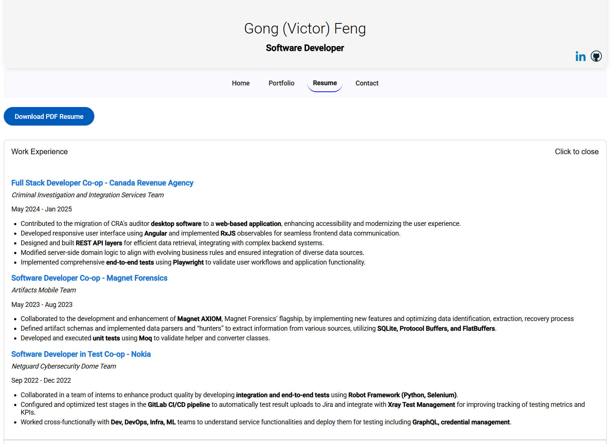

# Angular Portfolio App

This is my personal portfolio website built with Angular, Typescript, HTML5, CSS3 and Angular Material. I have already deployed this app on Firebase, Check the link to explore the website: https://personal-portfolio-a67e2.web.app.

This project was generated with [Angular CLI](https://github.com/angular/angular-cli) version 19.1.7.

# Installation pre-requisites

 Node.js

# Installing the Angular CLI

With the following command the angular-cli will be installed globally in your machine:

    npm install -g @angular/cli 

# To run the Development UI Server

To run the project, we will use the Angular CLI:

    npm start 

The application is visible at port 4200: [http://localhost:4200](http://localhost:4200)

Note: **make sure to use command npm start and not ng serve, as npm start adds a couple extra options that are needed for our project **

# Home Page: 
The home page has two cards, the left one is for the brief introduction of the person, the right one is to show the feature project.

# Portfolio Page;
The portfolio page contains a list of project cards, and it has a button to filter the projects using specific programing languages and frameworks.

# Resume Page:
The resume page has a button to download my pdf resume, and the accordion to show different sections of my resume.

# Contact Page:
The contact page contains the information to reach out to me.
